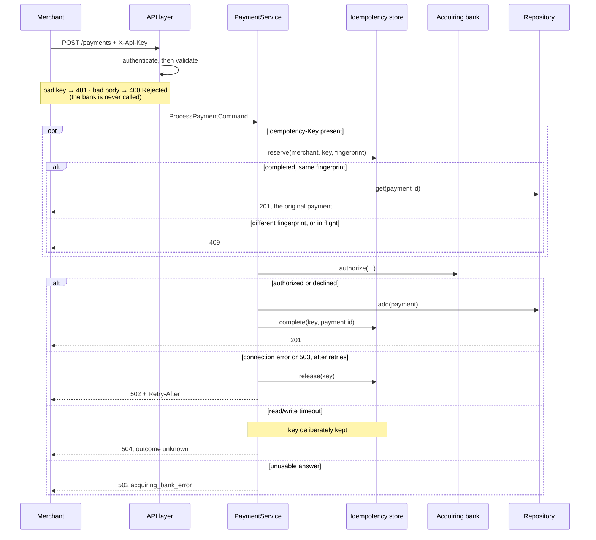

# Payment Gateway API

A payment gateway that validates card payment requests, forwards them to an acquiring
bank, and lets a merchant retrieve a payment it made earlier.

- `POST /payments` process a card payment
- `GET /payments/{id}` retrieve a previously made payment
- `GET /` liveness probe, no API key required

Interactive docs at http://localhost:8000/docs once the app is running.

---

## Running it

```bash
make install      # poetry install (Python 3.13)
make simulator    # docker compose up -d bank_simulator
make run          # http://localhost:8000
```

Or the whole stack in containers: `docker compose up --build`.

```bash
make test                # unit + component: 156 tests, ~2s, no network
make test-integration    # 6 tests against the running simulator
make test-all
make lint / make format  # ruff
```

Every setting lives in [config.py](payment_gateway_api/config.py) and can be overridden
with a `GATEWAY_*` env var or a `.env` file. See [.env.example](.env.example).

---

## Using the API

Every request needs an `X-Api-Key` header identifying the merchant. Two keys are
configured out of the box: `sk_test_alpha` and `sk_test_beta`. The simulator decides the
outcome from the card number's last digit: odd authorizes, even declines, `0` returns a
503.

```bash
curl -X POST http://localhost:8000/payments \
  -H 'Content-Type: application/json' \
  -H 'X-Api-Key: sk_test_alpha' \
  -d '{
        "card_number": "2222405343248877",
        "expiry_month": 4,
        "expiry_year": 2030,
        "currency": "GBP",
        "amount": 1050,
        "cvv": "123"
      }'
```

```json
{
  "id": "0470143c-9a4a-4912-9dd8-c79d11df3a06",
  "status": "Authorized",
  "last_four_card_digits": "8877",
  "expiry_month": 4,
  "expiry_year": 2030,
  "currency": "GBP",
  "amount": 1050
}
```

```bash
curl http://localhost:8000/payments/0470143c-9a4a-4912-9dd8-c79d11df3a06 \
  -H 'X-Api-Key: sk_test_alpha'
```

### Responses

| Situation | Status | Body |
|---|---|---|
| Authorized or declined by the bank | `201` | the payment, `status: "Authorized" \| "Declined"` |
| Invalid payment details | `400` | `{"status": "Rejected", "errors": [{"field", "message"}]}` |
| Missing or unknown API key | `401` | `{"error": "unauthorized"}` |
| Unknown payment id, or another merchant's | `404` | `{"error": "payment_not_found"}` |
| Idempotency key reused with a different body, or still in flight | `409` | `{"error": "idempotency_conflict"}` |
| Bank unreachable, payment definitely not taken | `502` + `Retry-After` | `{"error": "acquiring_bank_unavailable"}` |
| Bank answered unusably, our integration is at fault | `502` | `{"error": "acquiring_bank_error"}` |
| Bank timed out, outcome unknown | `504` | `{"error": "acquiring_bank_timeout"}` |
| Anything unexpected on our side | `500` | `{"error": "internal_error"}` |

### Validation

| Field | Rules |
|---|---|
| `card_number` | required, string, 14 to 19 characters, digits only |
| `expiry_month` | required, integer, 1 to 12 |
| `expiry_year` | required, integer, 2000 to 2100; with the month, must not be in the past |
| `currency` | required, 3 characters, one of `GBP`, `USD`, `EUR` (case-insensitive) |
| `amount` | required, integer of at least 1, in **minor** units (`1050` = £10.50), with a configurable ceiling |
| `cvv` | required, string, 3 or 4 characters, digits only |

Validation is strict, so `"1050"` is not coerced into an integer. Unknown fields are
rejected rather than ignored, so a typo like `"ammount"` is reported instead of silently
becoming a different payment. All failing fields are reported at once:

```json
{
  "status": "Rejected",
  "errors": [
    { "field": "currency", "message": "Unsupported currency: XYZ, currency must be one of GBP, USD, EUR" },
    { "field": "cvv", "message": "String should have at least 3 characters" },
    { "field": "ammount", "message": "Extra inputs are not permitted" }
  ]
}
```

### Idempotency

`POST /payments` accepts an optional `Idempotency-Key` header, a 36 character UUID.
Replaying it returns the original payment instead of taking a second one.

```bash
curl -X POST http://localhost:8000/payments \
  -H 'X-Api-Key: sk_test_alpha' \
  -H 'Idempotency-Key: 0c8f6f3a-3e9a-4f0e-9a19-9d3f3b1f5b6a' \
  -H 'Content-Type: application/json' -d '{...}'
```

Keys are scoped
per merchant and checked against an HMAC-SHA256 fingerprint of the request (merchant, card
number, expiry, currency, amount), so reusing one with a different payment is a `409`, and
so is a duplicate arriving while the first is still with the bank. If the bank was never
reached, the key is released so the merchant can safely retry with it.

### Traceability

Every response carries an `X-Request-Id` header, echoed from the client or generated. Logs
are JSON and every line carries that id, so one payment can be followed end to end. Only
the route template is logged, never the query string.

---

## Design



### Structure

```
payment_gateway_api/
├── api/               HTTP only: routers, schemas, services, middlewares, error mapping
├── domain/            models, errors, and the ports (Protocols) the service needs
├── infrastructure/    adapters: HTTP bank client, in-memory repository and idempotency store
├── config.py          settings, overridable via GATEWAY_* env vars
├── dependencies.py    auth and wiring of the adapters into the service
├── logger_config.py   JSON logging with the request id attached
└── app.py             composition root: builds the concrete adapters in the lifespan
```

Dependencies point inwards. `domain` imports nothing, the service depends only on domain
ports, `infrastructure` implements them, and `api` is the only layer that knows about
HTTP. The ports are `typing.Protocol`s, so adapters need no inheritance and tests pass
plain fakes. Swapping the in-memory repository for Postgres, or the simulator for a real
acquirer, means one new class and one changed line in `app.py`.

**Why layers and not domain modules.** This is one bounded context with two endpoints, so
a technical layering is the honest structure. On a larger system I would slice by domain
first (`payments/`, `refunds/`, `disputes/`, each owning its own layers internally),
because layer-first structure stops scaling once the `services` package becomes a bag of
unrelated things.

### Key decisions

**Rejected is a `400`, not a `422`.** The brief treats rejection as a first-class outcome
of the payment API, so it gets a payment-shaped body rather than FastAPI's validation
format. `PaymentStatus` holds only `Authorized` and `Declined`, because a rejected request
never became a payment and is never stored.

**A bank failure is never recorded as a decline**, since that would be a lie the merchant
cannot detect. The two kinds of failure are told apart, because the difference is
financial:

| Evidence | Response | Idempotency key |
|---|---|---|
| `503` after retries, or a connection failure: definitely not taken | `502` + `Retry-After`, safe to retry | released |
| Read or write timeout: may have been taken, we never saw the answer | `504`, outcome unknown | kept, so a replay is a `409` rather than a double charge |
| Unexpected status or unparsable body: we cannot use the answer | `502`, no retry advice | kept |

Nothing is persisted in any of the three cases, and an unexpected error in our own code is
treated as unknown too. Resolving a genuinely unknown outcome needs reconciliation against
the acquirer, so guessing is not an option.

**The bank's status codes and messages are never relayed to the merchant.** Every acquirer
outcome is mapped onto our own small and stable set of error codes. Passing theirs through
would break every merchant integration the day the acquirer renames a field, would make a
second acquirer speak a different error language for the same situation, and would leak
integration detail. The concrete case here: the simulator answers `400` when a field is
missing, but our validation makes every field required, so that can only mean we built the
request wrongly. It is logged loudly for us and reported as `acquiring_bank_error` with no
invitation to retry.

**Retries are narrower than the HTTP convention.** Authorization is not idempotent and the
simulator offers no key of its own, so we retry only failures that prove the request never
reached processing: connection errors, connect and pool timeouts, and `503`, with
exponential backoff and full jitter. A read timeout means the request was delivered and the
payment may already have been taken, and `502` and `504` from an intermediary carry the
same ambiguity, while a `500` is deterministic and would only reproduce itself. A double
charge is worse than a retry the merchant makes themselves.

**Only the last four digits are stored.** The full PAN exists in the request object and the
outbound call to the bank, nowhere else. PAN and CVV are excluded from every model's
`repr`, so a stray log line or a traceback cannot leak them, and there are tests asserting
exactly that.

**Payments are scoped to a merchant**, and a foreign id returns `404` rather than `403`,
because a `403` would confirm that the id exists.

**Immutable domain models.** The in-memory repository hands out references to the objects
it stores, so frozen dataclasses stop a caller rewriting stored state by accident.

### Assumptions

- `GBP`, `USD` and `EUR` are supported, per the brief's "no more than 3 currency codes".
  The list is configuration, not code.
- A card is valid through the end of its expiry month, evaluated in UTC.
- Authorization codes are stored but not returned, since the brief's response tables omit
  them.
- Authentication is a static key-to-merchant map. It demonstrates scoping and is not a real
  credential system.
- Storage is in-memory, as the brief permits, so payments do not survive a restart.

### Concurrency and scaling

In one process the design is safe under load. The idempotency store serialises reserve,
complete and release behind an `asyncio.Lock`, so two concurrent requests with the same key
cannot both reach the bank, and the adapters are tested under concurrency.

Across processes it does not scale yet, which is the honest cost of in-memory storage.
`main.py` pins `workers=1` deliberately, because a second worker would hold its own store
and could charge a shopper twice. A second instance behind a load balancer has the same
problem, and a restart loses every payment made so far. `GET /` is therefore a liveness
probe only; a real deployment would add `/health/ready` reflecting acquirer reachability
and shutdown state. All of this disappears once the stores move to Postgres behind their
existing ports, where a unique index on `(merchant_id, key)` gives across a cluster what
the lock gives inside one process.

### Security: what is and is not defended

Defended: cardholder data reaching logs, tracebacks or responses; one merchant reading
another's payments; double charges caused by client bugs or retry storms; internal state
disclosure on a `500`; upstream detail leaking into our contract.

Out of scope here, and needed before real money moves: credential strength (keys are
static, unhashed and not rotatable, and possession alone is enough to move money, which
request signing is what fixes); transport security, since TLS is assumed to terminate in
front of the app; rate limiting and card-testing detection; fraud screening such as 3-D
Secure, AVS and velocity checks; PCI DSS, since the gateway touches the PAN in memory at
all; secret management and audit logging of administrative access.

### Testing

| Suite | What it covers |
|---|---|
| `tests/unit/` | Every validation rule; service orchestration and idempotency against fakes; the bank client against a mocked transport (wire format, retries, malformed responses); the adapters under concurrency; that cardholder data never reaches a log or a traceback |
| `tests/unit/test_validation_properties.py` | Property-based (hypothesis): arbitrary input never crashes the validator, and anything it accepts really does satisfy the rules |
| `tests/components/` | The full app over HTTP with only the bank stubbed: status codes, response shapes, auth, merchant scoping, idempotency, correlation ids, and that internal errors leak nothing |
| `tests/integration/` | The real Mountebank simulator: authorize, decline, the 503 to 502 path, and retrieval |

Tests are named after the behaviour they protect rather than the method they call, and
warnings are errors.

---

## What would come next in production

1. **Real storage.** Postgres behind the existing ports, with migrations. The idempotency
   store becomes a table with a unique index on `(merchant_id, key)` plus a TTL.
2. **Never hold the PAN.** Tokenize at the edge, or take card details through a hosted
   field, so the gateway handles a token and drops out of PCI scope almost entirely.
3. **Signed requests, not just a bearer key.** Hashed and rotatable keys, but above all a
   stolen key alone should not be enough to move money. Each merchant gets a signing
   secret and sends `HMAC-SHA256(secret, timestamp + nonce + raw body)`, which proves the
   merchant sent the request and that nobody altered the amount in flight, with the
   timestamp and nonce defeating replay. Larger merchants would get mTLS or asymmetric
   signing. The idempotency fingerprint does not do this, since it is computed from the
   request we already received, so it catches client bugs rather than forgery.
4. **Resilience.** A circuit breaker around the acquirer so a sustained outage fails fast,
   and a reconciliation job for payments left unknown by a timeout. With an acquirer that
   accepts an idempotency key the retry policy could widen safely, including `429` while
   honouring `Retry-After`.
5. **Graceful shutdown.** Uvicorn already traps `SIGTERM` and runs the lifespan teardown
   that closes the HTTP client, but killing a process mid-authorize manufactures exactly
   the "outcome unknown" case this design works hardest to avoid. A deploy should flip
   readiness to unhealthy first so the load balancer stops sending traffic, drain in-flight
   requests within a bounded window (`--timeout-graceful-shutdown`, plus a preStop delay on
   Kubernetes), and only then close the bank client, logging anything still in flight so
   reconciliation can pick it up.
6. **Observability.** OpenTelemetry traces spanning the bank call, and a `/metrics`
   endpoint for Prometheus. Beyond the usual rate, error and latency metrics, the ones that
   matter here are authorization versus decline rate, decline reasons, bank latency
   percentiles, retries, timeouts, breaker state and idempotency conflicts. An
   authorization-rate drop is how a broken integration is usually noticed first, long
   before error rates move, because a decline is a perfectly successful HTTP request.
7. **A full audit trail.** Today only authorized and declined payments are persisted, so a
   rejected or failed attempt leaves the merchant nothing. Recording every attempt as an
   immutable append-only record (no PAN or CVV, only the last four and a fingerprint) lets
   a merchant answer "what happened to order 1234?" without a support ticket, and is what
   reconciliation, dispute handling and regulators read. Writing it must never be able to
   fail the payment itself.
8. **Product surface.** Refunds, voids, captures, 3-D Secure, multi-acquirer routing, and
   webhooks so merchants learn about asynchronous outcomes.
9. **CI.** Lint and the test suites on every PR, omitted here only to avoid burning Actions
   minutes on a take-home.
10. **Load and soak testing** before anyone puts real money through it.

---

## Template notes

The scaffold has been reorganised, as the template invites. Its health endpoint (`GET /`)
and conventions are preserved: `make install`, `make run` and `make test` work as
documented, `main.py` is still the entrypoint, and `imposters/` and `.editorconfig` are
untouched. Python moved from 3.8 (end of life) to 3.13, and pydantic from v1 to v2.
